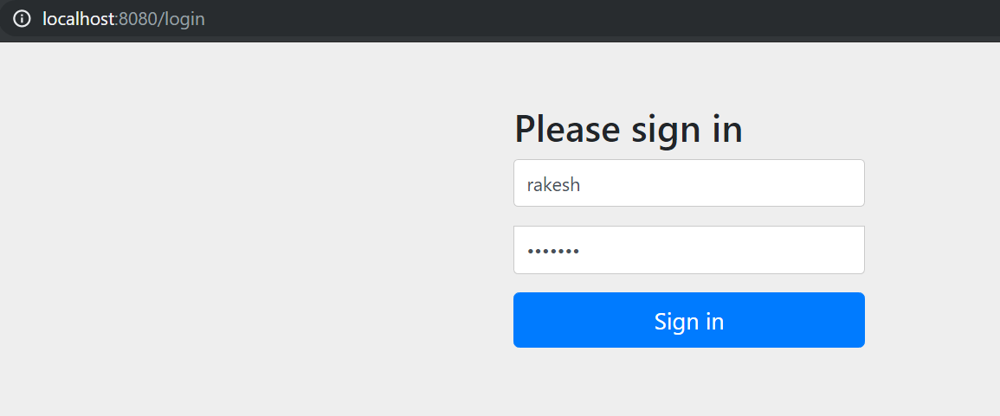

**Craft Demo**

**Use cases in scope:**

\* For REST API

- User LDAP Authentication integration using Login page
- User  should able to posts a tweet
- Follower also allow to send the tweets
- User can view the Home Timeline for followers with Limit or pagination of tweets

\* Unit test cases: POSTMAN or Unit cases

\* Database design and scripts

\* High level system design

**Assumption and Limitation:**

\* Every User/follower send 10 message a day

\* 100 max most recent tweets to be displayed

\* Optimize for fast reading to fetch Home page Timeline data

\* Per character tweets size is 140 character (140 bytes)

**Not In scope:** Heavy read search- Memory cache – Memcache/Redis etc.

**High Level Diagram:       **

 

**Database design and script:** (By default this scripts are loaded and created the table with populate some data for test)

**Schema SQL:**

DROPTABLE IF EXISTS USERS;

DROPTABLE IF EXISTS TWEETS;

DROPTABLE IF EXISTS FOLLOWS;

CREATETABLE USERS (

  user\_id INT AUTO\_INCREMENT  PRIMARYKEY,

  user\_name VARCHAR(140) NOTNULL,

  age INTNOTNULL);

CREATETABLE TWEETS (

  twit\_id INT AUTO\_INCREMENT  PRIMARYKEY,

  user\_id INTNOTNULL,

  follow\_id INTNOTNULL,

  msg\_txt VARCHAR(140) DEFAULTNULL,

  pub\_date TIMESTAMPDEFAULT CURRENT\_TIMESTAMP);

CREATETABLE FOLLOWS (

  follow\_id INT AUTO\_INCREMENT  PRIMARYKEY,

  follow\_name VARCHAR(140) NOTNULL);

ALTERTABLE TWEETS ADDCONSTRAINT fk\_user\_id FOREIGNKEY (user\_id) REFERENCES USERS(user\_id);

ALTERTABLE TWEETS ADDCONSTRAINT fk\_follow\_id FOREIGNKEY (follow\_id) REFERENCES FOLLOWS(follow\_id);

**Data Sql:**

INSERTINTO USERS (user\_name, age) VALUES('rakesh', 24);

INSERTINTO FOLLOWS (follow\_name) VALUES ('Rick'),('Sam'),('Rob');

INSERTINTO TWEETS (user\_id, follow\_id, msg\_txt) VALUES(1, 1, 'hi'),(1, 2, 'hello'),(1, 3, 'how r u');

**LDAP Schema and Data for Login LDIF file:**

objectclass: top

objectclass: domain

objectclass: extensibleObject

dc: springframework

dn: ou=groups,dc=springframework,dc=org

objectclass: top

objectclass: organizationalUnit

ou: groups

dn: ou=people,dc=springframework,dc=org

objectclass: top

objectclass: organizationalUnit

ou: people

dn: uid=rakesh,ou=people,dc=springframework,dc=org

objectclass: top

objectclass: person

objectclass: organizationalPerson

objectclass: inetOrgPerson

cn: Rakesh B

sn: Bharati

uid: rakesh

userPassword: {SHA}fDYHuOYbzxlE6ehQOmYPIfS28/E=

**Unit Test cases:**

Login LDAP Authentication form: (user and password: rakesh/abcd123)

After sign-in page:

**REST API:**

* Post tweet message: (It has a dependency on users and follows records before call this API)

- Junit from code: DemoApplicationTests.tweetData()

* Home Page API from browser:  (Need to set 100 as limit to fetch 100 most recent tweets)

   URL: [http://localhost:8080/homepage?offset=0&limit=5](http://localhost:8080/homepage?offset=0&limit=5)

